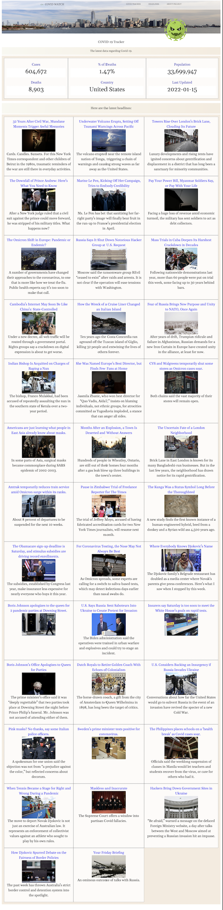

# project_1

# Group Members

1. Robert World
2. Veedit Parikh
3. Habon Assoweh
4. Helody Francois

# Description

Github page: https://sabrtraveler.github.io/project_1/

The Covid pandemic has been a terrible globalexperience. The Covid Watch app was designed toget the latest Covid-19 data in the United States. Inaddition, you will also be able to view the latest newsheadlines from across the globe. This data isautomatically updated every 12hrs.

2 Apis
Covid tracker api - https://github.com/ExpDev07/coronavirus-tracker-api  
New York Times news - https://developer.nytimes.com/apis

The following images shows the web application's appearance and functionality:  

